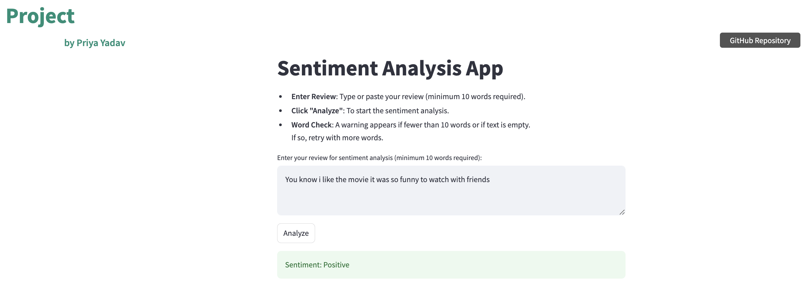

# Sentiment Analysis App

## Overview

This repository hosts a **Sentiment Analysis App** designed to predict the sentiment (positive or negative) of movie reviews. Using Docker, the app offers a straightforward setup, ensuring reliable performance across diverse environments. The primary model in this app is an **LSTM-based neural network** paired with a **TF-IDF vectorizer** for text preprocessing. The app's model was trained on the [Stanford Large Movie Review Dataset](http://ai.stanford.edu/~amaas/data/sentiment/aclImdb_v1.tar.gz).

In the development phase, different models, including Vanilla RNN and GRU, were tested, with LSTM emerging as the most effective in terms of performance and stability.



---

## Features

- **Streamlit Interface**: An interactive, user-friendly interface for review upload and analysis.
- **Sentiment Prediction**: Classifies movie reviews as either positive or negative.
- **LSTM Model**: Core architecture for sentiment classification, optimized for handling text sequences.
- **Dockerized Deployment**: Easy containerized setup using `docker-compose` for reproducibility.
- **Model Comparisons**: Evaluated multiple architectures (Vanilla RNN, GRU) for optimal performance.

---

## Getting Started

### Prerequisites

- [Docker](https://docs.docker.com/get-docker/)
- [Docker Compose](https://docs.docker.com/compose/install/)

### Setup and Run

1. **Clone the Repository**:

   ```bash
   git clone https://github.com/your-username/sentiment-analysis-app.git
   cd sentiment-analysis-app
